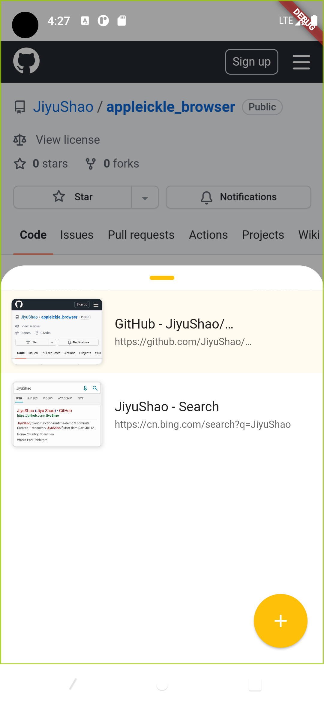

# appleickle_browser

## 简介

本项目是一个跨端浏览器项目，主要技术栈为：

- flutter 3.0.4
- flutter_inappwebview

## 快速开始

在运行以下命令前请先设置好 `flutter devices`

```bash
# 安装依赖
flutter pub get

# 在设备上运行代码
flutter run
```

## 截图展示

<div>
    
    
    
    
</div>
